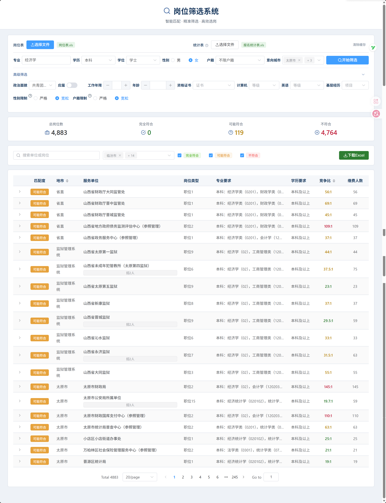
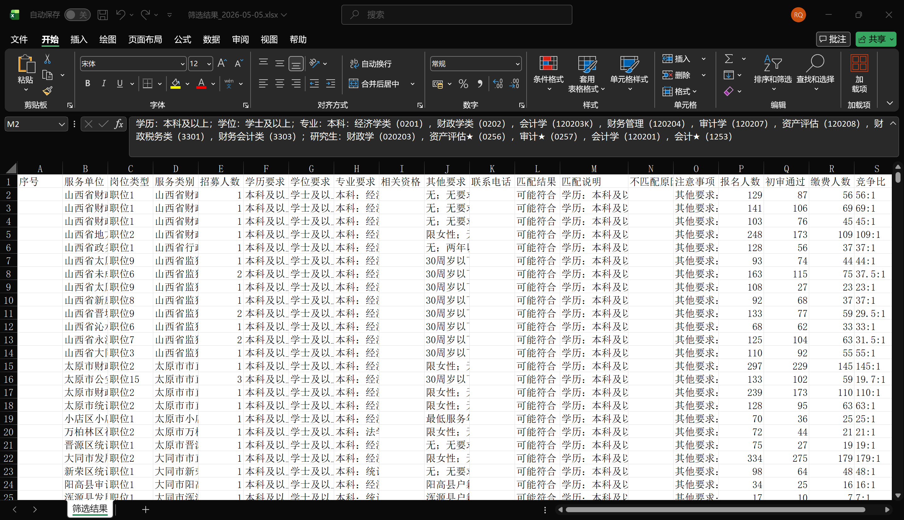

# JobMatch 智能选岗系统

> 一个本地运行的 Excel 岗位筛选工具——让考公考编考生在**不上传任何个人信息**的前提下，把"岗位表 + 报名统计表"自动合并、按个人条件智能筛选、导出匹配结果。

[](https://frontend-gamma-seven-37.vercel.app)

---

## 技术栈

| 层级 | 技术 | 版本 |
|------|------|------|
| 框架 | Vue | 3.4 |
| 构建工具 | Vite | 5.0 |
| UI 组件库 | Element Plus | 2.5 |
| Excel 解析 | SheetJS (xlsx) | 0.18.5 |
| 模糊匹配 | fuse.js | 7.3 |
| 图标 | lucide-vue-next | 1.0 |
| HTTP | axios | 1.6 |
| 部署 | Vercel 静态托管 | - |

**无后端、无数据库、无登录。** 所有运算在浏览器内完成。

---

## 核心模块

- **浏览器内 Excel 解析引擎**：基于 SheetJS 实现多 Sheet 合并、智能列头识别、多行表头解析、日期格式转换，处理真实考试中各种非标准 Excel 格式
- **多表关联 Join 算法**：设计"岗位代码 + 岗位名称"复合关联键，处理格式漂移（全半角、前后空格、前导零），实现岗位表与报名统计表的自动合并
- **条件匹配引擎**：学历向下兼容（本科可报"本科及以上"）、专业类目包含（"经济学"⊆"经济学类"）、多字段联合匹配与评分
- **Vue3 组件与状态管理**：FilterPanel（筛选面板）+ ResultPanel（结果面板）组件设计，localStorage 持久化用户画像与筛选结果
- **UI/UX 设计**：从左右分栏重构为上下操作流，优化表单交互、空状态、加载态与错误提示

---

## 在线演示

**访问地址**：https://frontend-gamma-seven-37.vercel.app

### 截图

截图放在 `webapp/frontend/public/screenshots/`，命名规范：

| 序号 | 文件名 | 内容 |
|------|--------|------|
| 1 | `screenshot-home.png` | 首页（文件上传区域） |
| 2 | `screenshot-filter.png` | 筛选条件配置面板（上传成功后） |
| 3 | `screenshot-results.png` | 筛选结果列表（含多表关联后的竞争比） |
| 4 | `screenshot-export.png` | 导出结果的 Excel 预览 |





---

## 核心功能

### 单表筛选
上传岗位 Excel，按以下维度智能筛选：
- 专业（支持大类包含，如"经济学类"包含"经济学"）
- 学历（向下兼容：本科可投"本科及以上"）
- 性别、户籍、政治面貌、年龄
- 意向城市
- 资格证书、计算机/英语等级
- 基层工作经验

### 多表关联
同时上传**岗位表**和**报名统计表**，系统自动：
1. 识别两张表的同义列头（"专业要求"="所学专业"="专业"）
2. 按"岗位代码 + 岗位名称"关联
3. 结果中展示报名人数、竞争比等统计信息

### 结果导出
筛选结果导出为 Excel，保留原表结构，新增：
- 匹配结果（完全符合 / 可能符合 / 不符合）
- 匹配说明与不匹配原因
- 竞争比（关联统计表后）

---

## 快速开始

```bash
cd webapp/frontend
npm install
npm run dev
```

打开浏览器访问 `http://localhost:3000`

构建生产版本：

```bash
npm run build
```

产物输出至 `webapp/frontend/dist/`。

---

## 实现难点与踩坑记录

### 1. 纯前端架构的取舍
**背景**：早期版本有后端（Python）和微信小程序，维护成本高，且用户担心上传个人信息被培训机构获取。

**决策**：砍掉后端和微信小程序，全部运算迁到浏览器内。用 SheetJS 解析 Excel，用 Vue3 reactive 管理状态，localStorage 做持久化。

**代价**：大文件解析会阻塞主线程（后续可上 Web Worker），但换来了"零隐私风险"的核心卖点。

### 2. Excel 表头的"混沌现实"
**问题**：不同考试、不同年份的官方 Excel，表头命名完全不统一——"专业要求"、"所学专业"、"专业"、"专 业"（中间有空格），甚至多行表头。

**解法**：设计了多层兜底策略：
- 第一层：同义词映射表（预设常见列名变体）
- 第二层：模糊匹配（fuse.js 对表头做相似度匹配）
- 第三层：内容特征识别（根据列内数据类型推断列含义）

**教训**：永远不要用 `header[0] === '专业'` 这种精确匹配去处理真实世界的 Excel。

### 3. 多表关联的格式漂移
**问题**：岗位表里的岗位代码是 `"0123"`，统计表里可能是 `"123"` 或 `"0123 "`（带空格），直接字符串相等 join 会丢数据。

**解法**：关联前对关联键做标准化——去空格、统一全半角、补前导零。同时用"岗位代码 + 岗位名称"做复合关联键，单字段漂移时另一字段兜底。

**教训**：关联键的标准化逻辑要比匹配逻辑更复杂。

### 4. localStorage 与 Vue Reactive 的引用陷阱
**问题**：初始把默认表单对象写成常量引用，用户清除缓存后重置表单，结果把原始默认值也污染了。清除缓存后页面 reload 才能恢复，体验极差。

**解法**：
- 默认表单改为工厂函数返回新对象，避免引用共享
- 用 `:key` 强制重新挂载 FilterPanel 组件来彻底重置状态
- 去掉页面 reload，改为程序内状态重置

**教训**：Vue 的 reactive 对象和 localStorage 的 JSON 序列化之间，引用问题会连环爆炸。

### 5. 脏数据过滤
**问题**：官方 Excel 里除了岗位数据，还混有说明文字、表头注释、汇总行。早期直接全量解析，结果筛选结果里出现了"备注"、"说明"这种假岗位。

**解法**：加数据校验层——有效岗位必须同时有"单位名称"和"岗位类型"字段，用这条规则过滤掉 90% 的脏数据。

**教训**：不要相信任何"官方数据源"是干净的，导入层必须做防御性校验。

### 6. 布局重构：从左右分栏到上下流
**问题**：早期左右分栏（左边筛选条件，右边结果），在笔记本屏幕上筛选面板需要滚动，文件上传和结果查看的视线来回跳。

**决策**：重构为上下布局——顶部文件上传 → 中间筛选条件（inline 排列） → 底部结果表格。操作流从上往下，一次性完成。

**教训**：工具类产品的布局要以"操作流"而非"信息结构"为核心。

### 7. 先写产品定义，再写代码
**背景**：项目经历过一次大重构——后端 + 小程序 → 纯前端。

**做法**：重构前先写 `PRODUCT.md`，明确"做什么"和"不做什幺"（不登录、不预测上岸概率、不做 AI 语义匹配）。后续每次需求膨胀时，都回到这份文档对齐。

**教训**：没有"不做什幺"的清单，项目会无限膨胀，最终什么都做不好。

---

## 支持考试

| 考试 | 数据情况 | 适用功能 |
|---|---|---|
| 国考 | 只有岗位表，无官方统计 Excel | 单表筛选 |
| 山西省考 | 岗位表 + 报名统计表 | 单表筛选 + **多表关联** |
| 山西事业编联考 | 岗位表 + 报名统计表 | 单表筛选 + **多表关联** |
| 三支一扶 | 岗位表 + 报名统计表 | 单表筛选 + **多表关联** |

---

## 数据隐私

- **不上传**：Excel 文件在浏览器内解析，不发送到任何服务器
- **不登录**：无账号系统，不收集手机号等个人信息
- **本地缓存**：筛选结果仅保存在浏览器 localStorage 中，7 天后自动清除

---

## 项目结构

```
JobMatch/
├── webapp/
│   └── frontend/              # Vue3 前端应用（唯一活跃代码）
│       ├── src/
│       │   ├── App.vue
│       │   ├── components/    # 页面组件
│       │   │   ├── FilterPanel.vue   # 筛选条件面板
│       │   │   └── ResultPanel.vue   # 结果展示面板
│       │   ├── engine/        # 核心筛选引擎（浏览器内运行）
│       │   │   ├── excel.js       # Excel 解析 + 智能列识别
│       │   │   ├── matcher.js     # 条件匹配引擎
│       │   │   ├── joiner.js      # 多表关联（岗位表 join 统计表）
│       │   │   └── parseOther.js  # "其他要求"字段解析
│       │   └── services/
│       │       └── api.js     # 前端业务接口层（无网络请求）
│       ├── package.json
│       └── vite.config.js
├── data/
│   └── samples/               # 真实考试数据样本（用于测试）
├── archive/                   # 旧代码归档（server/、miniprogram/ 等）
├── PRODUCT.md                 # 产品定义文档
└── README.md                  # 本文件
```

---

## 许可证

MIT License
